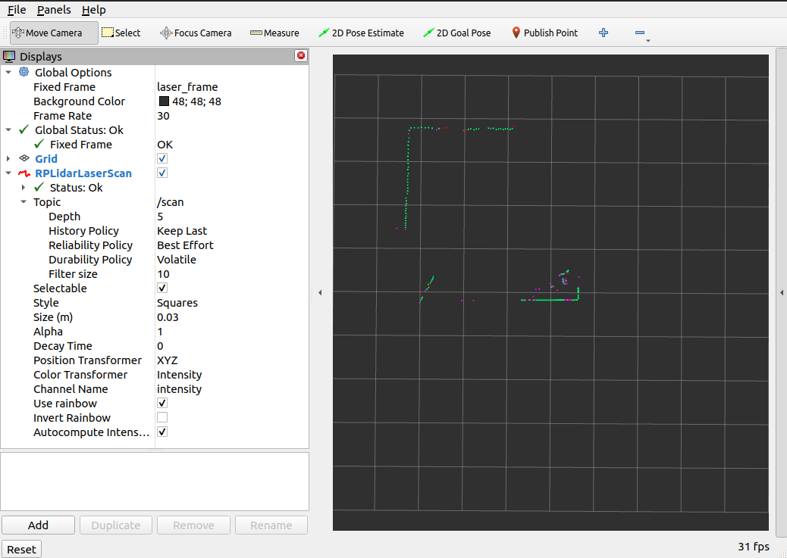

# YDLiDAR scan results in rviz
---

The work presented here is based upon [this repository](https://github.com/YDLIDAR/ydlidar_ros2_driver). To get the results as in the preview below, at your terminal, type the following command:

```zsh
ros2 launch ydlidar_ros2 ydlidar.launch.py
```


